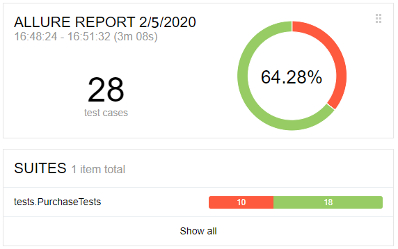

# Отчёт о проведённом тестировании
### Краткое описание
Cервис "Покупка тура" был протестирован с использованием следующих инструментов:
* Docker Desktop
* Java 8
* junit-jupiter: 5.5.1
* selenide: 5.3.1
* allure 2.13.1
* Lombok
* MySql и PostgreSQL

### Были протестированы сценарии, которые прописаны в плане тестирования:
[План автоматизации тестирования](https://github.com/drevnik/AQA_diplom/blob/master/docs/Plan.md)

### Количество тест-кейсов

* Успешная покупка - 3 сценария, 2 успешных ;
* Неуспешная покупка - 3 сценария, 1 успешное;
* Негативные проверки полей (невалидные значения, незаполненные поля) - 22 сценария, 15 успешных.
* Всего: 28 тест-кейсов (Успешных: 18, неуспешных:10)

### Общие рекомендации

Рекомендуется исправить ошибки в приложении.
